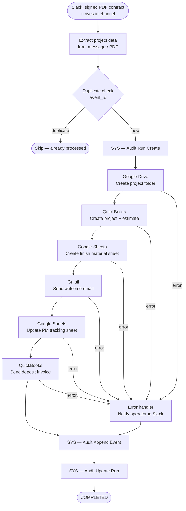

# Architecture

## System Diagram

## Component Ownership

| Component | Responsibility |
|---|---|
| Slack | Trigger — receives signed PDF contract |
| n8n main workflow | End-to-end onboarding orchestration |
| Audit sub-workflows | Run and event logging |
| Google Drive | Project folder / workspace |
| QuickBooks | Project record, estimate, deposit invoice |
| Google Sheets (materials) | Finish material sheet |
| Gmail | Welcome email to client |
| Google Sheets (PM) | PM tracking sheet update |
| Error handler | Notifies operator on any step failure |
| Human operator | Manual review and retry of failed steps |

## Reusable Sub-Workflows

| Sub-workflow | Purpose |
|---|---|
| SYS — Audit Run Create | Opens a new audit run record |
| SYS — Audit Append Event | Logs an individual step result or failure |
| SYS — Audit Update Run | Closes the run with final status |
