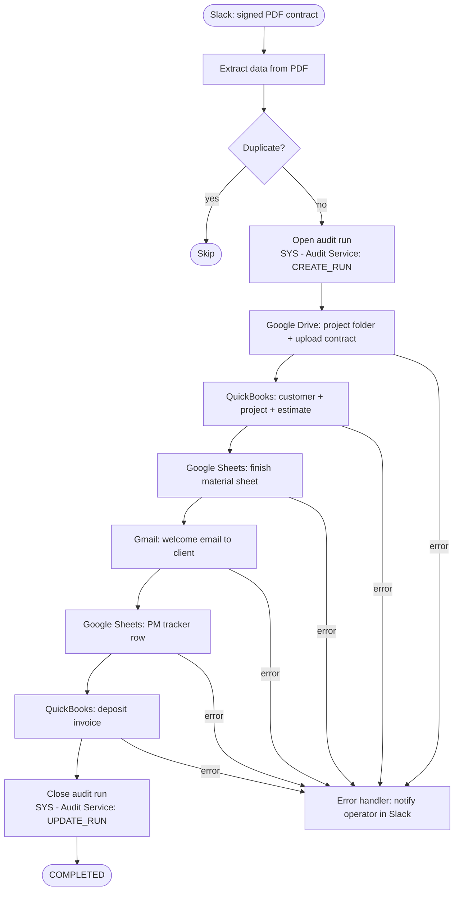

# Architecture

## What this system does

Automates new client onboarding: when a signed PDF contract arrives in Slack, the system creates the full project infrastructure without human involvement — a Drive folder, a QuickBooks record, a materials sheet, a welcome email, and a PM tracker row.

---

## Design Principles

**Orchestrator pattern.** The main workflow contains no business logic. It normalizes input, validates, deduplicates, then delegates each step to a focused sub-workflow with a defined contract.

**Fail-fast validation.** All required fields are verified before the audit run is opened and before any external resource is created. A missing email or empty milestones list stops the workflow immediately with a descriptive error.

**Idempotency via source_event_id.** The Slack `event_ts` is used as a deduplication key. On every trigger the workflow checks the `automation_runs` sheet by `source_event_id`; if a matching row already exists the run is skipped without creating any resources.

**Accumulated state.** Each sub-workflow receives the full accumulated state and returns it plus its own namespace (`workspace`, `qb`, `fm`). By the end of the chain, everything is available in one object.

---

## System Diagram



---

## Components

| Component | Role |
|---|---|
| Slack | Trigger — channel where the signed PDF arrives |
| n8n (main workflow) | End-to-end onboarding orchestrator |
| Google Drive | Project folder with subfolders + PDF contract storage |
| QuickBooks | Customer record, project, estimate, deposit invoice |
| Google Sheets (FM) | Finish material sheet per project |
| Gmail | Welcome email to client |
| Google Sheets (PM) | Shared PM tracking sheet |
| SYS - Audit Service | System workflow: CREATE_RUN / APPEND_EVENT / UPDATE_RUN |
| Error handler | Notifies operator on any failure |

---

## Workflow Structure

One main workflow, three sub-workflows, and one system service:

```
MAIN - New Project Onboarding
├── SYS - Audit Service (CREATE_RUN)       ← open run record
├── SUB - Create Project Workspace         → folder_id, upload_id
├── SUB - Create QB Record                 → customer_id, project_id, estimate_id
├── SUB - Create Finish Material Sheet     → sheet_id, sheet_url
└── SYS - Audit Service (UPDATE_RUN)       ← close run record
```

`SYS - Audit Service` is a single workflow with three operations: `CREATE_RUN`, `APPEND_EVENT`, `UPDATE_RUN`. Called via `executeWorkflow` with fields `operation` and `payload`. Returns `{ success, operation, data, error }`.

Sub-workflows are split by cohesion: each owns its API calls and returns only what it produces. Gmail, deposit invoice, and PM tracker are single HTTP calls that live inline in the main workflow.

**Order matters:** `folder_id` from Workspace is needed by FM Sheet; `customer_id` from QB is needed by the invoice and PM tracker. The sub-workflows run in this order for that reason.

---

## Data Flow

```
Slack trigger
  → PDF extraction → state { run_id, event_id, client, project, milestones, materials, ... }
  → SYS Audit (CREATE_RUN)  → persists run to automation_runs (status: RUNNING)
  → SUB Workspace            → + workspace { folder_id, upload_id }
  → SUB QB                   → + qb { customer_id, project_id, estimate_id, estimate_number }
  → SUB FM Sheet             → + fm { sheet_id, sheet_url }
  → inline steps (Gmail, Invoice, PM Sheet) read from accumulated state
  → SYS Audit (UPDATE_RUN)  → updates run in automation_runs (status: SUCCESS, finished_at)
```

State is built once at the start and never mutated. Each sub-workflow appends its own namespace.

---

## Error Handling

All workflows reference a shared error handler. On any unhandled error, n8n routes execution there — the operator gets a Slack notification and the failure is logged to the audit sheet.

No in-workflow try/catch. Errors propagate immediately, preventing partial state (e.g. Drive folder created but QB record missing) from being silently swallowed.
